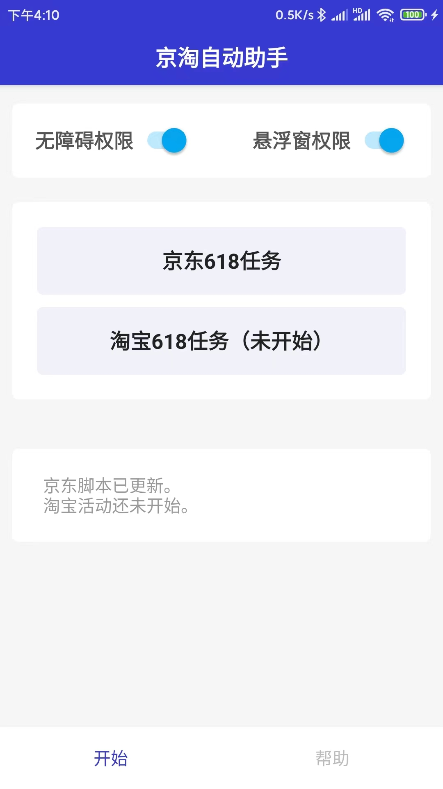
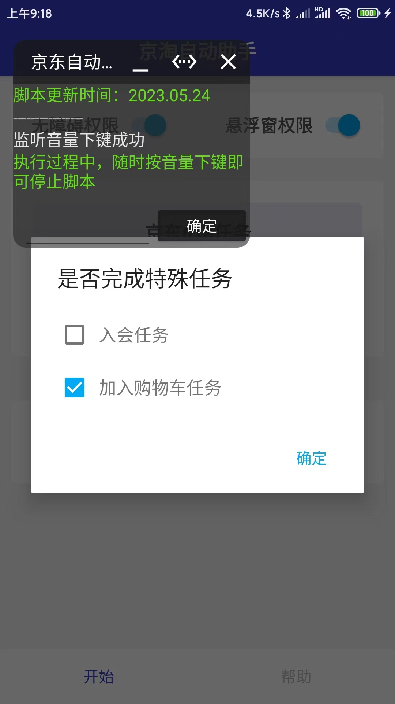

2023.618脚本已更新。

## 软件下载
- https://wwwb.lanzouw.com/b02pys7pc

## 运行效果

  
  
  
  

## 特别申明

本仓库仅用于对视觉障碍人士辅助操作的学习研究，禁止用于商业用途，不能保证其合法性，准确性，完整性和有效性，请根据情况自行判断。

本项目内所有资源文件，禁止任何公众号、自媒体进行任何形式的转载、发布。

本人对任何脚本问题概不负责，包括但不限于由任何脚本错误导致的任何损失或损害。

请勿将此项目的任何内容用于商业或非法目的，否则后果自负。

出现bug直接提issue，请附上机型、系统版本、截图、错误日志等

基于Auto.JS 4.1.1开发，感谢原开发者https://github.com/hyb1996/Auto.js

因为内含打开淘宝的操作，部分手机管家会报风险软件。除了无障碍操作和悬浮窗权限外，其他任何权限都可以拒绝授予。（推荐允许网络权限检查更新）小米手机必须打开后台弹出窗口权限，否则无法申请截屏权限。
